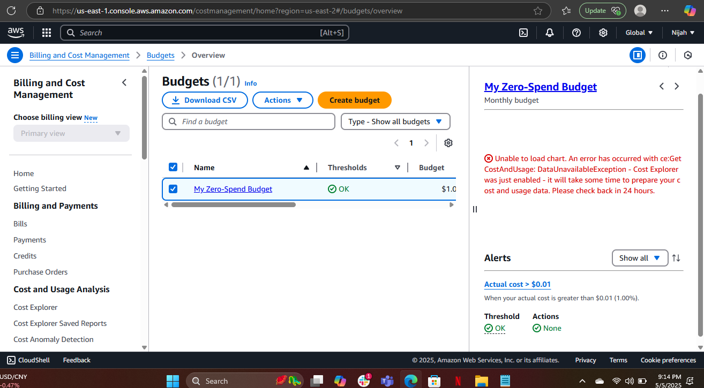

# AWS - Setup

I started off creating an account on AWS an I added all of the required information. I then created an IAM account with a MFA. 

A few things I noticed about AWS that I feel like will be useful to me in the future as a developer are, the ability to use SDK with node.js and Dynamoose. These tools are very powerful and can help turn a basic site into a site more adventurous for users. I can also add multiple people to my account if need be without hendering my workflow. I feel like there's still a lot to learn and I am very excited to get into it. 